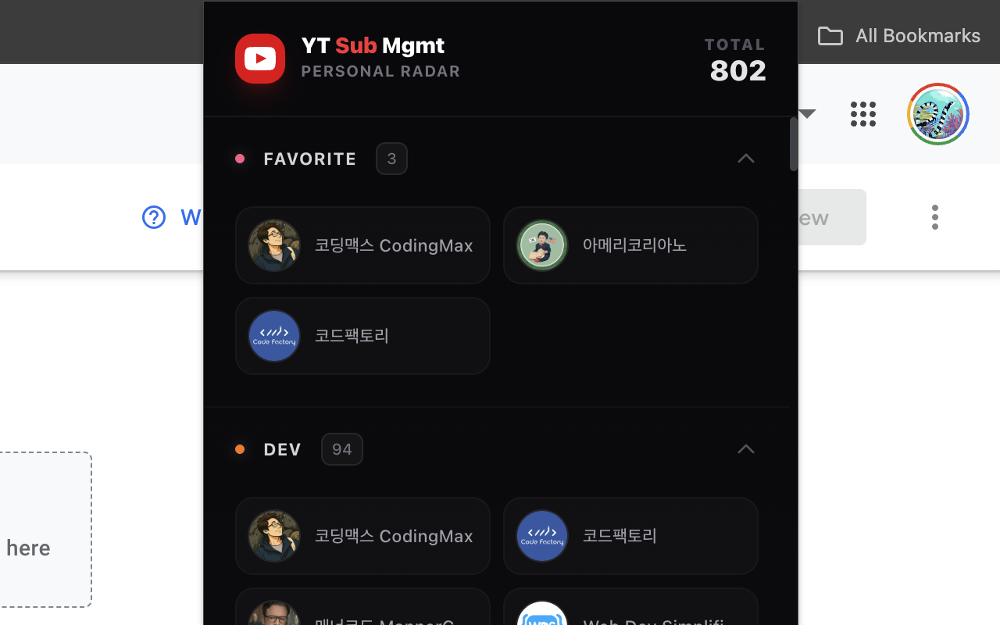
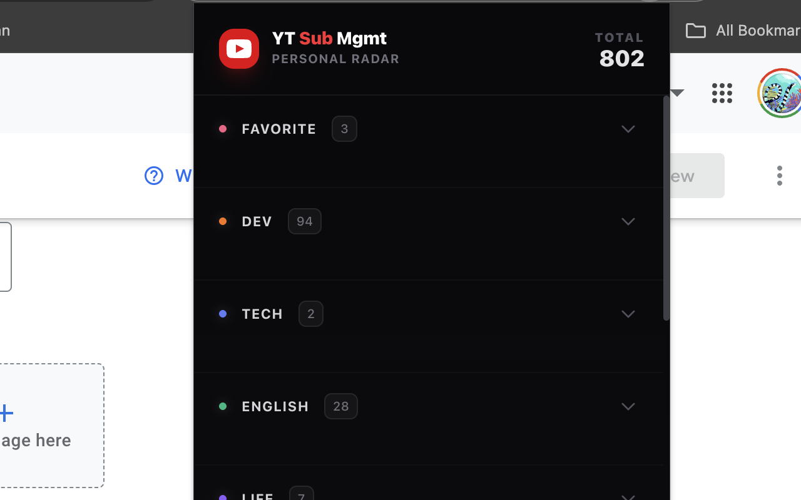
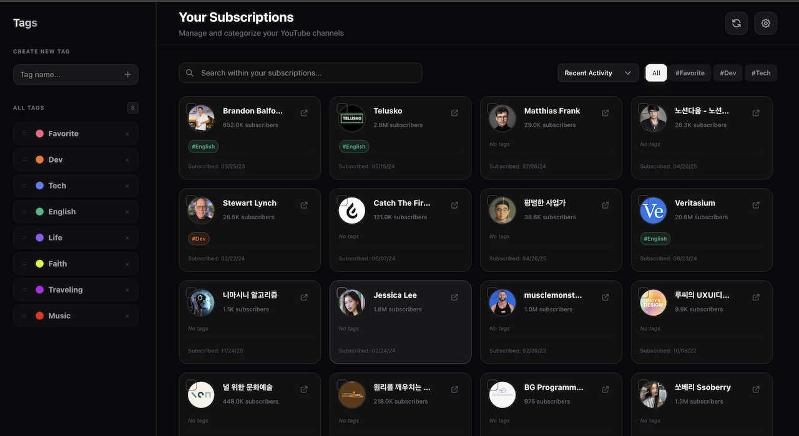
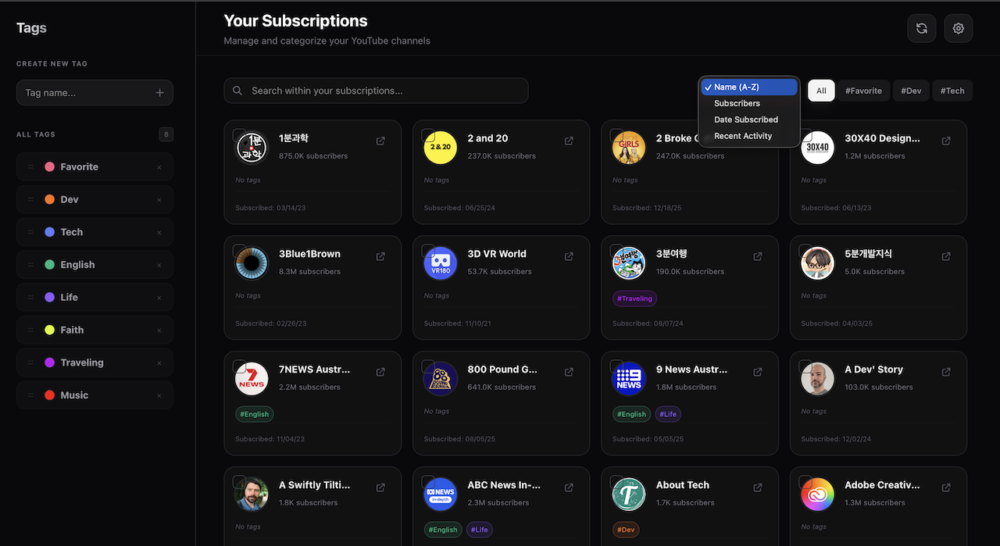
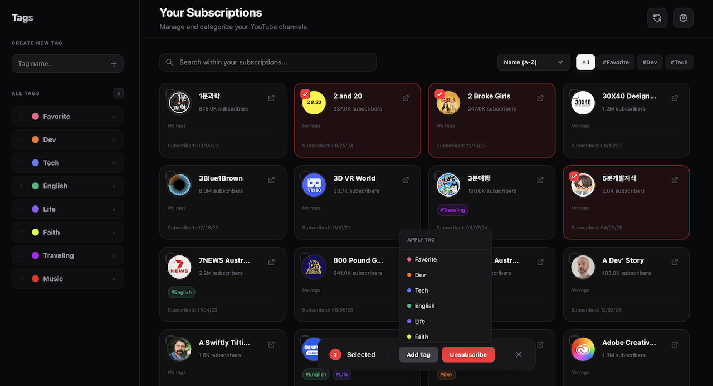
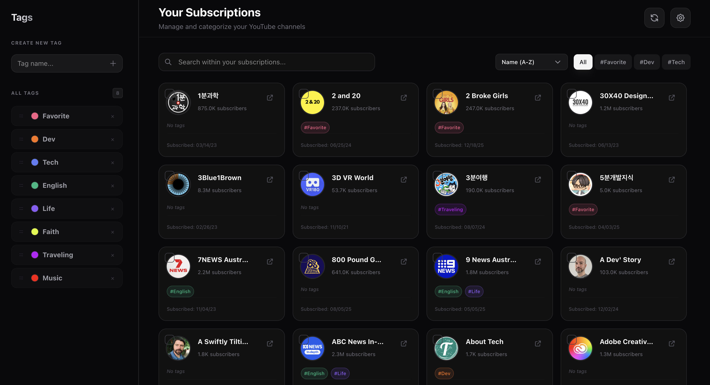

#  YouTube Subscription Manager — Premium Edition

> **A professional YouTube subscription management solution for managing 1000+ channels effortlessly.**

This extension innovatively improves YouTube's lacking subscription management features. Categorize hundreds of channels smartly, detect inactive channels, and enjoy content according to your own priorities.

---

## 📸 Screenshots

  
  

  
  

  
  

---

## ✨ Key Innovations

### 🚀 Intelligence Delta Sync (v3)
A proprietary synchronization engine designed for users with massive subscription lists.
- **ETag-based Zero-Quota**: Uses no API quota when communicating with YouTube servers if there are no changes.
- **Activity Detection Radar**: Efficiently updates by detecting the latest activity of all channels with a single API call.

### 🗂️ Dynamic Priority Groups
Group and manage channels by tags in both the popup and dashboard.
- **Grid List Accordion**: Provides a sleek UI in the popup where you can collapse and expand groups by tag.
- **Contextual Drag & Drop**: Instantly change tag priorities in the sidebar with a simple drag-and-drop.

---

## 🛠️ Key Features

### 1. Professional Dashboard (Management)
- **Intelligent Inactivity Detection**: Automatically categorizes channels with no uploads for N months and notifies you of candidates for cleanup.
- **Tag & Priority Management**: Create unlimited tags and adjust priorities via drag-and-drop.
- **Data Backup & Recovery**: Safely export and import tag settings and channel data as JSON.

### 2. High-Performance Popup (Usage)
- **Usage-Focused Design**: A minimal design that removes management metrics and focuses purely on channel discovery and viewing.
- **Automatic "Untagged" Management**: Automatically separates untagged channels into a bottom group to keep your main interests at the top.

---

## 🔒 Privacy & Security (Privacy First)

This extension adheres to the **"Privacy-First"** principle.
- **Local Storage**: User tag information and channel data are stored only on the user's computer (`chrome.storage`).
- **No External Communication**: No data is sent to external servers except for license verification.
- **Principle of Least Privilege**: Requests only the essential YouTube API permissions necessary for operation.

---

## 💻 Developer Information

- **Stack**: React 18, TypeScript, Vite, Tailwind CSS v4.
- **License**: Custom Commercial License

---

"Find your real interests buried in hundreds of channels."  
[Visit Chrome Web Store](https://chrome.google.com/webstore)
